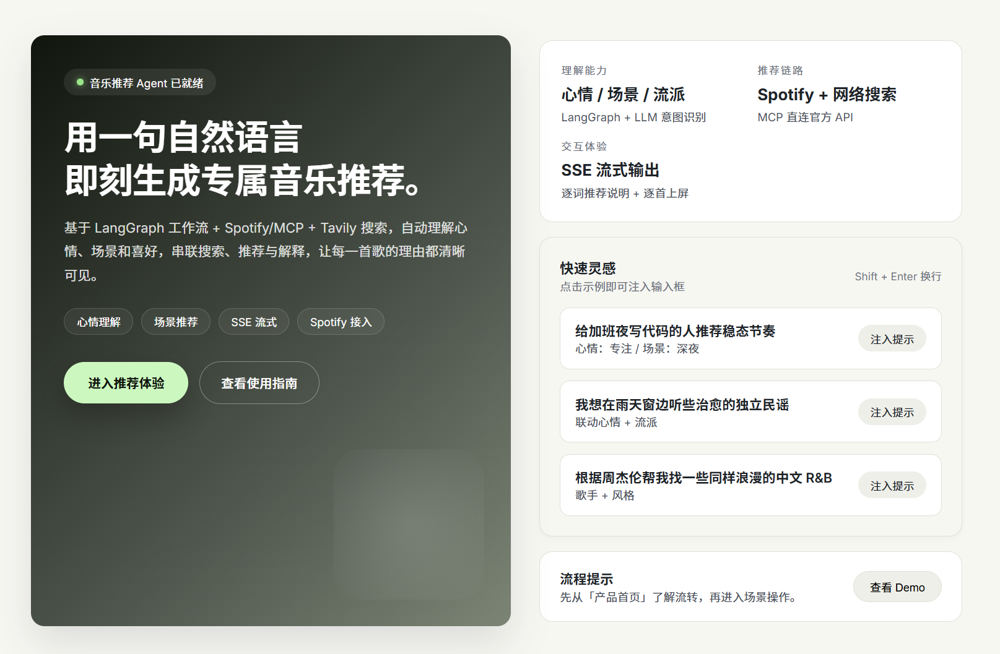
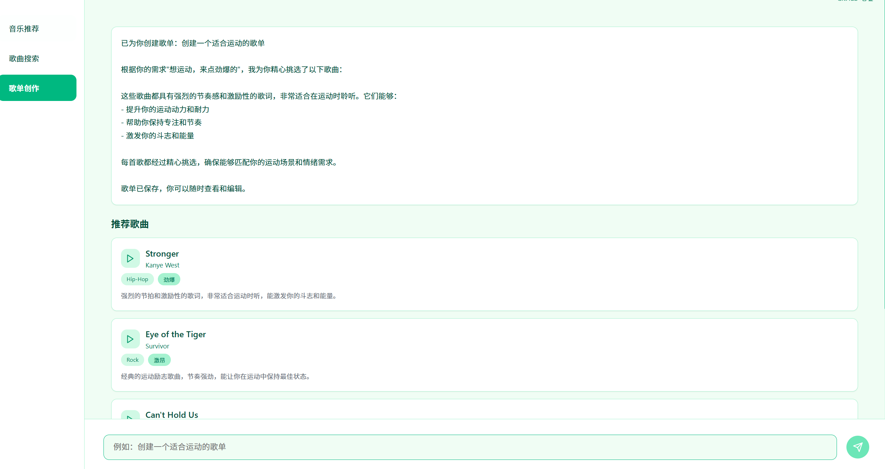

<p align="center">
  
</p>

<h1 align="center">音乐推荐 Agent</h1>

<p align="center">
  用自然语言和 AI 获取个性化音乐推荐。
</p>

---

## Highlights

- 🎯 智能理解心情、场景、流派等需求，一键生成推荐歌单
- 🔍 集成搜索、推荐与解释，让你知道每首歌的推荐理由
- ⚡ **SSE流式输出**：实时流式渲染推荐结果，提供更好的用户体验
- 🌐 **前后端分离**：FastAPI后端 + Next.js前端，现代化架构
- ⚙️ 基于 LangGraph + Streamlit，轻量部署即可运行
- 🔐 支持自定义 LLM（DeepSeek、Qwen 等）与本地音乐数据

## 项目概览

音乐推荐 Agent 是一个面向内容创作者与音乐爱好者的 AI 助手。通过自然语言对话即可完成：

- 心情或场景驱动的歌单生成
- 特定歌手、流派的音乐探索
- 推荐背后逻辑的透明解释
- **实时流式输出**：推荐结果逐词显示，歌曲逐个添加
- **RESTful API**：提供完整的API接口，支持前后端分离
- 面向下一步集成的 API 化扩展接口

项目默认使用硅基流动提供的 DeepSeek / Qwen 模型，也可接入其他 OpenAI 风格的 LLM 服务。

### 架构特点

- **后端**：FastAPI + LangGraph，支持SSE流式输出
- **前端**：Next.js + React，现代化UI体验
- **数据流**：SSE（Server-Sent Events）实现实时流式渲染
- **代理层**：Next.js API路由作为SSE代理，简化前后端通信


## 使用指南

### Web 界面

1. 打开浏览器访问 `http://localhost:8501`
2. 在“智能推荐”页输入需求（心情、场景、歌手等）
<p align="center">
  
</p>
3. 在“音乐搜索”页按关键字过滤本地音乐库
<p align="center">
  
</p>
4. 查看侧边栏快捷按钮，快速测试预设场景
<p align="center">
  
</p>


## Quick Start

### 环境要求

- Python 3.8+
- pip / uv / poetry 等任意包管理工具
- 可选：GPU 环境以加速本地推理

### 安装

```bash
git clone <your-repo-url>
cd deep-search
pip install -r requirements.txt
```

### 配置密钥

```json
{
  "SILICONFLOW_API_KEY": "",
  "SILICONFLOW_BASE_URL": "https://api.siliconflow.cn/v1",
  "SILICONFLOW_CHAT_MODEL": "Qwen/Qwen2.5-72B-Instruct",
  "TAILYAPI_API_KEY": "",
  "TAILYAPI_BASE_URL": "https://api.tavily.com",
  "APP_NAME": "DeepSearch Quickstart",
  "SPOTIFY_CLIENT_ID": "",
  "SPOTIFY_CLIENT_SECRET": ""
}
```

> 提示：也可通过环境变量 `SILICONFLOW_API_KEY` 等方式配置，无需 `setting.json`。

### 本地运行

#### 方式1：使用Streamlit界面（传统方式）

```bash
python run_music_app.py
```

访问 `http://localhost:8501` 即可体验 Web 界面。  
如需使用 Streamlit 自带命令，替换为：

```bash
streamlit run music_app.py
```

#### 方式2：使用FastAPI + Next.js（推荐，支持流式输出）

**启动后端API服务器：**

```bash
# 方式1：使用便捷脚本（推荐）
python run_api_server.py

# 方式2：使用启动脚本
python api/start_server.py
```

后端将在 `http://localhost:8501` 启动，API文档：`http://localhost:8501/docs`

**启动前端：**

```bash
cd web
npm install  # 首次运行需要安装依赖
npm run dev
```

前端将在 `http://localhost:3000` 启动

访问 `http://localhost:3000/recommendations` 体验流式推荐功能。

> 💡 **提示**：确保设置了 `SILICONFLOW_API_KEY` 环境变量或在 `setting.json` 中配置。

### 快速部署建议

- **Docker 化部署**：在项目根目录创建 Dockerfile，复制代码并执行 `streamlit run` 或 `uvicorn api.server:app`
- **云端部署**：
  - Streamlit界面：使用 Streamlit Community Cloud、Railway、Render 等平台
  - API服务器：使用 Railway、Render、Fly.io 等支持Python的平台
  - 前端：使用 Vercel、Netlify 等平台部署Next.js应用
- **内部使用**：可在企业 VPN 或内网环境中运行，结合 Nginx 做反向代理
- **生产环境**：建议使用 Gunicorn + Uvicorn workers 运行FastAPI，使用Nginx处理SSE连接

## 配置说明

- `SILICONFLOW_API_KEY`：硅基流动平台获取的 API Key
- `SILICONFLOW_BASE_URL`：硅基流动 API 路径，默认为 `https://api.siliconflow.cn/v1`
- `SILICONFLOW_CHAT_MODEL`：对话模型，例如 `deepseek-ai/DeepSeek-V3`


如需接入更多第三方服务，只需在 `setting.json` 中新增字段，并在 `config/settings_loader.py` 中读取。

## MCP 工具集

- `mcp/music_server_updated_2025.py`：封装 `search_tracks`、`get_recommendations`、`create_playlist`、`analyze_playlist` 等工具，直接调用 Spotify API（基于 Spotipy）。
- `mcp/siliconflow_server.py`：可选的 MCP 服务，用于与 SiliconFlow API 协同。
- `mcp/ARCHITECTURE_DIAGRAM.md`：系统架构示意，展示从 LangGraph 工作流到 MCP 再到 Spotify 的链路。
- `mcp/csv_to_json.py`、`mcp/analyze_songs.py`：辅助数据处理脚本，可生成/分析本地歌单。
- `mcp/verify_config.py`、`verify_spotify_config.py`：用于诊断凭证与网络状态。

> 想要单独运行 MCP 服务器，可在 `mcp/` 下安装 `requirements.txt` 后执行 `python music_server_updated_2025.py`，再在主项目中通过 `tools.mcp_adapter` 调用。

## 架构一览

### 工作流架构

```
用户请求
  └─▶ 意图识别 (analyze_intent)
        └─▶ 条件路由 (route_by_intent)
                ├─▶ search_songs           → 推荐解释
                ├─▶ generate_recommendations → 推荐解释
                └─▶ general_chat
                      ↓
                  最终响应
```

### 前后端数据流架构（SSE）

```
┌─────────────┐         ┌──────────────┐         ┌─────────────┐
│  前端组件   │ ──────> │ Next.js API   │ ──────> │ FastAPI     │
│ (React)     │         │ Route (代理)  │         │ Server      │
└─────────────┘         └──────────────┘         └─────────────┘
     ▲                        │                        │
     │                        │                        ▼
     │                        │                 ┌─────────────┐
     │                        │                 │ Music Agent │
     │                        │                 │ & Services  │
     │                        │                 └─────────────┘
     │                        │                        │
     └────────────────────────┴────────────────────────┘
                    SSE Stream (流式数据)
```

### 核心组件

- **LangGraph 工作流**：基于有向图节点管理不同任务
- **音乐工具层**：负责搜索、相似度匹配、心情标签解析
- **LLM 层**：负责自然语言理解与推荐解释生成
- **FastAPI 后端**：提供RESTful API和SSE流式接口
- **Next.js 前端**：现代化UI，支持实时流式渲染
- **Streamlit 前端**（可选）：传统Web界面，展示推荐结果、可视化推荐理由

## 技术栈

### 后端
- **FastAPI**：现代化Python Web框架，支持SSE流式输出
- **LangGraph**：工作流编排
- **LangChain**：LLM 能力封装
- **Uvicorn**：ASGI服务器
- **Pydantic**：数据校验与状态管理
- **asyncio**：异步调度，提高响应效率

### 前端
- **Next.js 14**：React框架，支持App Router
- **TypeScript**：类型安全
- **React Hooks**：状态管理
- **Fetch API**：SSE流式数据处理

### 可选界面
- **Streamlit**：快速原型和传统Web界面

## 数据与扩展

- 示例数据存储在 `data/music_database.json`
- 音乐条目字段包含标题、艺术家、流派、情绪标签、推荐理由等
- 未来可对接 Spotify、网易云、Apple Music 等真实数据源
- 支持嵌入模型，将用户喜好与历史行为写入向量数据库

## 测试与验证

- `python test_config.py`：确认 `setting.json` 加载成功、环境变量写入正确、SiliconFlow 模型可用。
- `python test_music_mcp.py`：在配置好 Spotify 凭证后运行，逐项验证搜索、心情/活动推荐与 LangGraph 智能体链路。
- Streamlit UI 内置系统状态面板，可实时检查 API Key、最近推荐、MCP 运行情况。

> 建议在首次部署或更换凭证后先跑通以上脚本，确保外部依赖可用。

## Repository Map

```
deep search/
├── api/                    # FastAPI后端服务器
│   ├── server.py          # API服务器主文件
│   ├── start_server.py    # 启动脚本
│   └── README.md          # API文档
├── web/                    # Next.js前端应用
│   ├── app/               # Next.js App Router
│   │   ├── api/           # API路由（SSE代理）
│   │   ├── recommendations/ # 推荐页面
│   │   └── ...
│   ├── components/        # React组件
│   └── lib/               # 工具函数（API客户端）
├── music_agent.py          # 智能推荐核心
├── music_app.py            # Streamlit 前端
├── run_music_app.py        # Streamlit启动脚本
├── run_api_server.py       # API服务器启动脚本
├── config/                 # 配置加载
├── graphs/                 # LangGraph 工作流
├── services/               # 服务层（歌单推荐等）
├── tools/                  # 推荐与搜索工具
├── data/music_database.json# 示例音乐数据
├── SSE_DATAFLOW.md        # SSE数据流设计文档
└── QUICKSTART.md           # 快速启动指南
```

## 新功能：SSE流式数据流

### 特性

- ✅ **实时流式输出**：响应文本逐词显示，提供打字机效果
- ✅ **状态实时更新**：思考、处理中、完成等状态实时反馈
- ✅ **歌曲逐个添加**：推荐歌曲逐个添加到列表，提升用户体验
- ✅ **错误处理**：完善的错误处理和连接管理
- ✅ **可取消请求**：支持随时取消正在进行的请求

### 使用示例

访问 `http://localhost:3000/recommendations`，输入查询后即可看到：
1. 思考指示器显示当前处理状态
2. 响应文本逐词流式显示
3. 推荐歌曲逐个添加到列表

### 相关文档

- `SSE_DATAFLOW.md` - 详细的数据流设计文档
- `api/README.md` - API服务器使用文档
- `QUICKSTART.md` - 快速启动指南

## Roadmap

- [x] SSE流式输出支持
- [x] FastAPI后端API
- [x] Next.js前端界面
- [√] 对接 Spotify / 网易云音乐 API，实现实时乐库
- [ ] 支持用户登录与偏好记忆
- [ ] 在线播放 & 歌单分享功能
- [ ] 推荐算法优化（协同过滤、向量检索）
- [ ] 多语言界面与推荐说明
- [ ] WebSocket支持（双向通信）
- [ ] 推荐进度条显示

## Contributing

欢迎以 Issue / PR 的形式提交需求或改进建议：

- Fork 本仓库并创建新分支
- 遵循已有代码风格，尽量补充测试或示例
- 在 PR 中说明变更背景与验证方式

## License

MIT License
