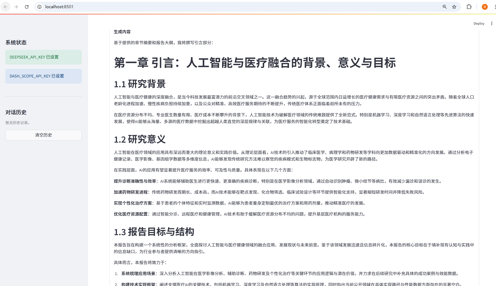

# Deep Search Agent

一个基于LangGraph的智能深度搜索和报告生成系统，能够自动进行网络搜索、研究规划、内容生成和引用管理。

## 功能特性

- 🔍 **深度网络搜索**: 自动搜索相关信息和资料
- 📋 **智能研究规划**: 自动制定研究和写作计划
- ✍️ **自动报告生成**: 基于搜索结果生成结构化报告
- 📚 **引用管理**: 自动管理参考文献和引用
- 🧠 **向量知识库**: 使用LlamaIndex构建智能知识库
- 🔄 **工作流编排**: 基于LangGraph的复杂工作流管理

## 项目架构

```
deep search/
├── config/                 # 配置管理
│   ├── settings.py        # 环境变量配置
│   └── logging_config.py  # 日志配置
├── llms/                  # LLM集成
│   ├── base.py           # LLM基类
│   ├── deepseek.py       # DeepSeek实现
│   └── openai_llm.py     # OpenAI兼容接口
├── schemas/               # 数据模型
│   └── graph_state.py    # 图状态定义
├── graphs/                # 工作流图
│   ├── deepsearch_graph.py    # 主工作流图
│   ├── research_executor.py   # 研究执行器
│   └── writing_executor.py    # 写作执行器
├── prompts/               # 提示词
│   ├── prompts.py        # 基础提示词
│   ├── planner_prompts.py     # 规划器提示词
│   ├── summarizer_prompts.py  # 总结器提示词
│   └── writer_prompts.py      # 写作器提示词
├── services/              # 服务层
│   └── llama_index_service.py # 向量存储服务
├── tools/                 # 工具
│   └── search_tools.py    # 搜索工具
├── angent.py             # 主入口文件
└── requirements.txt      # 依赖包
```

## 安装和配置

### 1. 安装依赖

```bash
pip install -r requirements.txt
```

### 2. 环境变量配置

创建 `.env` 文件并配置以下环境变量：

```env
# 硅基流动 API配置 (必需)
SILICONFLOW_API_KEY=your_siliconflow_api_key_here
SILICONFLOW_BASE_URL=https://api.siliconflow.cn/v1
SILICONFLOW_CHAT_MODEL=deepseek-chat

# DashScope API配置 (用于嵌入，可选)
DASH_SCOPE_API_KEY=your_dashscope_api_key_here
DASH_SCOPE_BASE_URL=https://api.deepseek.com
DASH_SCOPE_EMBEDDING_MODEL=text-embedding-ada-002

# 应用程序配置
APP_NAME=DeepSearch Quickstart
```

### 3. 运行测试

```bash
python angent.py
```
```bash
streamlit run streamlit_app.py
```

## 使用方法
</a>

### 基本使用

```python
import asyncio
from angent import DeepSearchAgent

async def main():
    # 创建智能体
    agent = DeepSearchAgent()
    
    # 执行搜索和报告生成
    result = await agent.search_and_generate_report(
        "人工智能在医疗领域的应用现状和发展趋势"
    )
    
    if result["success"]:
        print("报告:", result["report"])
        print("参考文献:", result["sources"])
    else:
        print("错误:", result["error"])

asyncio.run(main())
```

### 高级使用

```python
# 获取智能体状态
status = agent.get_status()
print("状态:", status)

# 带对话历史的查询
result = await agent.search_and_generate_report(
    query="继续上一个话题",
    chat_history=[{"role": "user", "content": "之前的问题"}]
)
```

## 工作流程

1. **规划阶段**: 根据用户查询制定研究和写作计划
2. **研究阶段**: 执行网络搜索，收集相关资料
3. **摘要阶段**: 对研究结果进行总结和整理
4. **写作阶段**: 基于研究资料生成报告章节
5. **整合阶段**: 生成最终报告和参考文献

## 技术栈

- **LangGraph**: 工作流编排
- **LangChain**: LLM应用框架
- **DeepSeek**: 大语言模型
- **LlamaIndex**: 向量存储和检索
- **ChromaDB**: 向量数据库
- **Pydantic**: 数据验证
- **aiohttp**: 异步HTTP客户端

## 注意事项

1. 需要有效的DeepSeek API密钥
2. 建议配置DashScope API密钥以获得更好的嵌入效果
3. 首次运行时会创建ChromaDB数据库
4. 网络搜索依赖DuckDuckGo，请确保网络连接正常

## 许可证

MIT License
