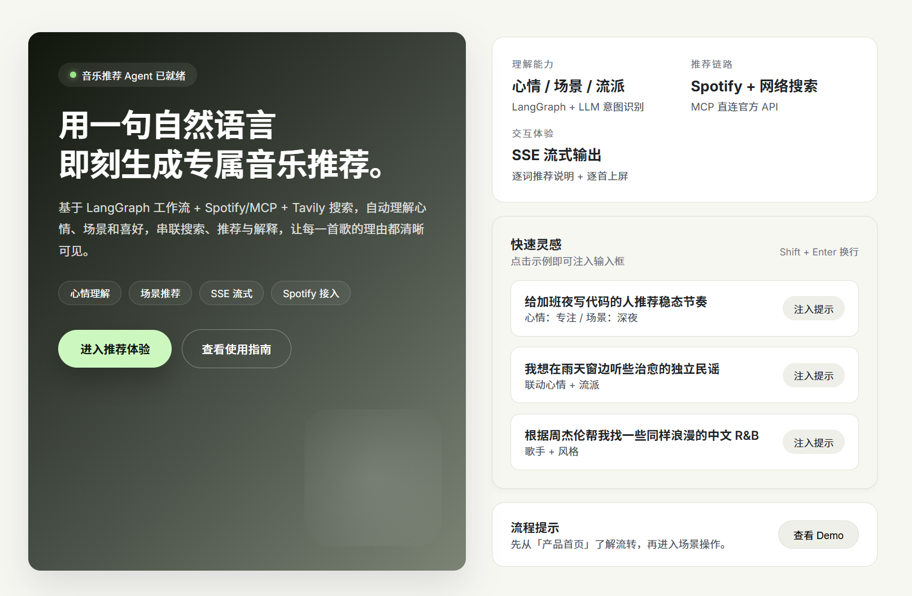
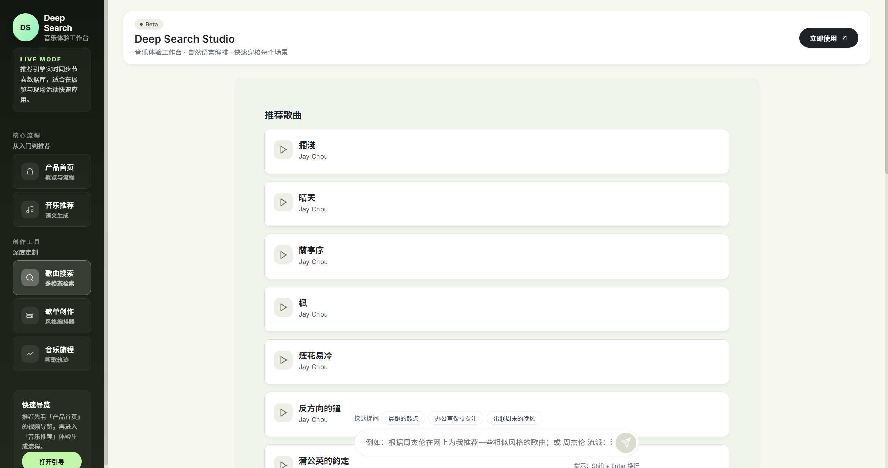
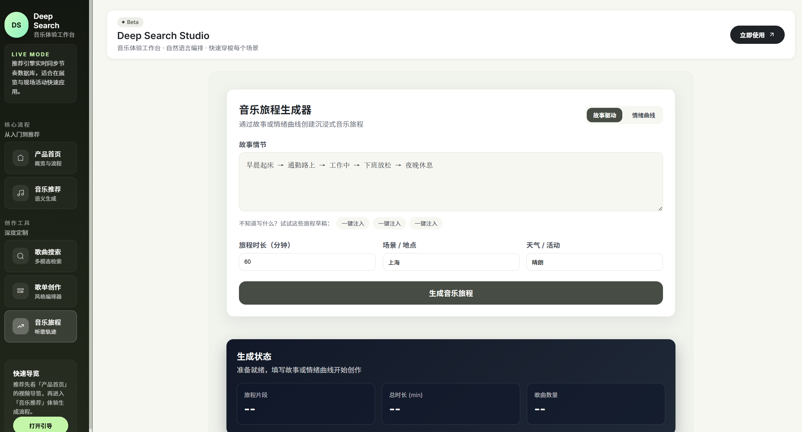

<p align="center">
  
</p>

<h1 align="center">音乐推荐 Agent · Music Recommendation Agent</h1>

<p align="center">
  一句自然语言，串起心情、场景与故事的整条音乐旅程。
</p>

<p align="center">
  <a href="http://localhost:3000/recommendations"><strong>立即体验流式推荐</strong></a>
  ·
  <a href="#quick-start">快速开始</a>
  ·
  <a href="#-%E6%9E%B6%E6%9E%84%E4%B8%80%E8%A7%88">架构一览</a>
</p>

---

## Highlights

- 🎯 **自然语言驱动的音乐推荐**：智能理解心情、场景、流派等需求，一句话生成推荐歌单
- 🗄️ **RAG 向量知识库**：ChromaDB 持久化存储 **147,434 首**歌曲（MusicBrainz 语料），Ollama bge-m3 语义检索
- 🎤 **歌词找歌（LLM 兜底）**：本地歌词库优先匹配，未命中时自动用 LLM 识别——覆盖范围从 21 首扩展到 LLM 知识边界
- 🎙️ **智能艺术家搜索**：支持精确名称、部分名称（"selena"）、无空格输入（"selenagomez"）三级匹配
- 📋 **搜索日志看板**：实时记录每次查询的搜索源（RAG / LLM / API）、搜索内容与结果歌曲列表
- ⚡ **实时流式体验**：SSE 流式渲染推荐结果，回应内容逐词出现、歌曲逐首上屏
- 🎼 **音乐旅程生成器**：按故事或情绪曲线自动划分段落，并为每段流式生成配套音乐（跨段自动去重）
- ⚙️ **LangGraph 工作流编排**：意图识别、搜索、推荐解释拆分为清晰节点，便于扩展
- 🌐 **现代化前后端架构**：FastAPI 后端 + Next.js 前端，支持 RESTful API 与系统集成

## 项目概览

音乐推荐 Agent 是一个面向内容创作者与音乐爱好者的 AI 助手，你可以像和朋友聊天一样，用自然语言描述你"想听什么"，其余交给系统完成：

- **心情 / 场景驱动的歌单生成**：例如「适合深夜加班写代码的节奏」或「和朋友自驾去海边」
- **基于歌手 / 流派的探索**：例如「按照周杰伦的风格，再找一些同样浪漫的中文 R&B」
- **歌词找歌**：输入一段模糊记得的歌词，系统先检索本地歌词库，未命中则调用 LLM 识别并返回结果与置信度
- **推荐背后逻辑的透明解释**：不仅给出歌单，还用自然语言说明为什么推荐这些歌
- **音乐旅程编排**：根据故事 / 情绪曲线划分段落，为每一段挑选节奏与氛围都契合的配套音乐
- **搜索日志追踪**：在日志页面查看每次请求的意图、搜索源、搜索关键词与结果，方便调试与观察
- **RESTful API**：提供完整的 API 接口，支持前后端分离与系统集成

项目默认使用硅基流动提供的 DeepSeek / Qwen 模型，也可接入其他兼容 OpenAI 接口风格的 LLM 服务。

### 主页面预览

<p align="center">
  
  <br />
  <sub>前端主页面：左侧导航 + 右侧推荐输入与结果区</sub>
</p>

### 音乐旅程编排（Music Journey）

在传统歌单之外，本项目特别提供「音乐旅程生成器」，适合播客创作者、展览策划、沉浸式空间与长时间专注场景使用：

- 你可以输入一段**故事**（例如"一天的情绪变化"）或一组**情绪时间点**（mood timeline）
- 系统会分析故事结构或情绪曲线，将整个时长划分为若干个**音乐阶段（Segments）**
- 每个阶段都会给出清晰的情绪标签、文字描述，并从 147k 向量知识库中语义匹配一组节奏与氛围契合的歌曲
- **跨段自动去重**：整条旅程不会出现重复曲目
- 通过 SSE 流式接口，**旅程结构、片段信息与每首歌会被逐步推送到前端**，便于实时可视化与交互

### 架构特点

- **后端**：FastAPI + LangGraph，支持 SSE 流式输出
- **向量检索**：ChromaDB（本地持久化）+ Ollama bge-m3 Embedding，147k 歌曲语料
- **歌词识别**：本地 difflib 匹配 + LLM 兜底，覆盖范围大幅提升
- **数据流**：SSE（Server-Sent Events）实现实时流式渲染
- **代理层**：Next.js API 路由作为 SSE 代理，简化前后端通信


## 使用指南

### Web 界面

1. 打开浏览器访问 `http://localhost:3000`
2. 在「音乐推荐」页输入需求（心情、场景、歌手等），通过 LangGraph 工作流 + LLM 生成带解释的音乐推荐
<p align="center">
  
</p>
3. 在「音乐搜索」页，通过 RAG 向量库 + Spotify 进行歌曲推荐 / 搜索，支持"歌手 + 流派 + 歌词"等自然语言请求
<p align="center">
  
</p>
4. 在「歌单创作」与「音乐旅程」视图中，查看推荐说明、歌单结构与整条音乐旅程的分段编排
<p align="center">
  
</p>
<p align="center">
  
</p>
5. 在「搜索日志」页查看每次请求的意图识别结果、搜索源（RAG / LLM / Spotify API）、搜索关键词及返回歌曲列表

## Quick Start

### 环境要求

- Python 3.10+
- Node.js 18+（前端）
- [Ollama](https://ollama.ai)（本地 Embedding，需拉取 `bge-m3:latest` 模型）
- pip / uv / poetry 等任意包管理工具

### 安装

```bash
git clone <your-repo-url>
cd Music-Research
pip install -r requirements.txt
```

### 拉取 Embedding 模型

```bash
ollama pull bge-m3:latest
```

> 首次运行前需确保 Ollama 服务在本地运行（`ollama serve`），bge-m3 模型用于将查询文本向量化后在 ChromaDB 中检索。

### 配置密钥

在项目根目录创建或编辑 `setting.json`：

```json
{
  "settings": {
    "SILICONFLOW_API_KEY": "your-siliconflow-api-key",
    "SILICONFLOW_BASE_URL": "https://api.siliconflow.cn/v1",
    "SILICONFLOW_CHAT_MODEL": "Qwen/Qwen2.5-72B-Instruct",
    "SILICONFLOW_EMBED_MODEL": "BAAI/bge-m3",
    "OLLAMA_BASE_URL": "http://localhost:11434/v1",
    "OLLAMA_EMBED_MODEL": "bge-m3:latest",
    "SPOTIFY_CLIENT_ID": "",
    "SPOTIFY_CLIENT_SECRET": ""
  }
}
```

| 字段 | 说明 |
|------|------|
| `SILICONFLOW_API_KEY` | 硅基流动 API Key（必填）|
| `SILICONFLOW_CHAT_MODEL` | 对话模型，如 `deepseek-ai/DeepSeek-V3` |
| `OLLAMA_BASE_URL` | Ollama 服务地址，默认 `http://localhost:11434/v1` |
| `OLLAMA_EMBED_MODEL` | 本地 Embedding 模型，默认 `bge-m3:latest` |
| `SPOTIFY_CLIENT_ID/SECRET` | 可选，接入 Spotify 实时乐库 |

### 本地运行

**启动后端 API 服务器：**

```bash
python run_api_server.py
```

后端将在 `http://localhost:8501` 启动，API 文档：`http://localhost:8501/docs`

**启动前端：**

```bash
cd web
npm install  # 首次运行需要安装依赖
npm run dev
```

前端将在 `http://localhost:3000` 启动。

> 💡 **提示**：确保 Ollama 服务正在运行（`ollama serve`），后端启动时会自动连接 ChromaDB 向量库。

## 向量知识库（RAG V2）

本项目内置基于 ChromaDB 的持久化向量知识库，支持语义检索 147,434 首歌曲：

```
数据来源：MusicBrainz corpus.jsonl
向量维度：1024（bge-m3）
相似度算法：余弦相似度
存储路径：data/chroma_db/
```

**构建 / 扩充知识库（可选）：**

```bash
# 从 corpus.jsonl 导入歌曲并生成 Embedding（使用本地 Ollama）
python scripts/build_chroma_db.py --all --local
```

> 知识库已预置，一般无需重新构建。仅当需要扩充新数据时使用上述命令。

## 歌词找歌

支持用模糊记得的歌词片段找到对应歌曲，采用两层策略：

1. **本地歌词库**：先用 difflib 在 `data/lyrics_database.json` 中做相似度匹配（阈值 0.6）
2. **LLM 兜底**：本地未命中时，自动调用 LLM 识别歌词并返回：
   - `title`：歌曲名
   - `artist`：艺术家
   - `confidence`：置信度（0.0–1.0）
   - `reason`：识别理由

```
用户: "有首歌歌词是 燃烧我的卡路里"
  ↓ 本地库未命中
  ↓ LLM 识别
  → 卡路里 / 火箭少女101（confidence: 0.95）
```

## 架构一览

### 工作流架构

```
用户请求
  └─▶ 意图识别 (analyze_intent)
        └─▶ 条件路由 (route_by_intent)
                ├─▶ search_songs           → RAG V2 语义搜索 → 推荐解释
                ├─▶ search_by_lyrics       → 歌词库 + LLM 兜底 → 推荐解释
                ├─▶ recommend_by_artist    → ChromaDB 元数据匹配 → 推荐解释
                ├─▶ recommend_by_genre     → RAG V2 语义搜索 → 推荐解释
                ├─▶ recommend_by_mood      → RAG V2 心情语义搜索 → 推荐解释
                ├─▶ recommend_by_activity  → RAG V2 场景语义搜索 → 推荐解释
                └─▶ general_chat
                      ↓
                  最终响应（SSE 流式）
```

### RAG 检索层

```
用户查询
  └─▶ Ollama bge-m3 生成查询 Embedding
        └─▶ ChromaDB 余弦相似度检索（147k 歌曲）
              └─▶ top_k × 3 原始结果
                    └─▶ (title, artist) 去重
                          └─▶ 返回 top_k 最相关歌曲
```

### 前后端数据流架构（SSE）

```
┌─────────────┐         ┌──────────────┐         ┌─────────────┐
│  前端组件   │ ──────> │ Next.js API   │ ──────> │ FastAPI     │
│ (React)     │         │ Route (代理)  │         │ Server      │
└─────────────┘         └──────────────┘         └─────────────┘
     ▲                        │                        │
     │                        │                        ▼
     │                        │                 ┌─────────────┐
     │                        │                 │ LangGraph   │
     │                        │                 │ + RAG + LLM │
     │                        │                 └─────────────┘
     │                        │                        │
     └────────────────────────┴────────────────────────┘
                    SSE Stream (流式数据)
```

### 核心组件

- **LangGraph 工作流**：基于有向图节点管理不同任务
- **RAG V2 检索引擎**：ChromaDB + Ollama bge-m3，支持语义搜索与艺术家元数据匹配
- **歌词识别引擎**：本地 difflib 匹配 + LLM 兜底，置信度感知返回
- **LLM 层**：负责自然语言理解与推荐解释生成（SiliconFlow DeepSeek/Qwen）
- **音乐旅程服务**：`MusicJourneyService` 支持故事/情绪曲线分析、分段规划与流式输出（跨段去重）
- **搜索日志系统**：内存记录最近 50 条查询，包含搜索源、关键词与结果歌曲
- **FastAPI 后端**：提供 RESTful API 和 SSE 流式接口
- **Next.js 前端**：现代化 UI，支持实时流式渲染

## 技术栈

### 后端
- **FastAPI**：现代化 Python Web 框架，支持 SSE 流式输出
- **LangGraph**：工作流编排
- **LangChain**：LLM 能力封装
- **ChromaDB**：本地持久化向量数据库
- **openai SDK**：直连 Ollama 生成 Embedding（避免 LangChain SSL 兼容问题）
- **Uvicorn**：ASGI 服务器
- **Pydantic**：数据校验与状态管理
- **asyncio**：异步调度，提高响应效率

### 前端
- **Next.js 14**：React 框架，支持 App Router
- **TypeScript**：类型安全
- **React Hooks**：状态管理
- **Fetch API**：SSE 流式数据处理

### AI / 数据
- **SiliconFlow**：托管 LLM（DeepSeek-V3、Qwen2.5 等）
- **Ollama + bge-m3**：本地 Embedding 生成
- **MusicBrainz**：147k 歌曲语料来源
- **Spotify API**（可选）：实时乐库搜索与推荐

## 测试与验证

```bash
# 验证配置加载与 SiliconFlow 模型可用
python test_config.py

# 验证 Spotify 凭证与 MCP 工具链
python test_music_mcp.py
```

> 建议在首次部署或更换凭证后先跑通以上脚本，确保外部依赖可用。

## Repository Map

```
Music-Research/
├── api/                      # FastAPI 后端服务器
│   ├── server.py             # API 主文件（路由、日志、SSE）
│   └── start_server.py       # 启动脚本
├── web/                      # Next.js 前端应用
│   ├── app/
│   │   ├── api/              # API 路由（SSE 代理）
│   │   ├── recommendations/  # 推荐页面
│   │   ├── journey/          # 音乐旅程页面
│   │   └── logs/             # 搜索日志看板
│   └── components/           # React 组件
├── graphs/                   # LangGraph 工作流
│   └── music_graph.py
├── tools/                    # 推荐与搜索工具
│   ├── music_tools.py        # 高层搜索 / 推荐函数
│   ├── rag_music_search_v2.py# RAG V2：ChromaDB + bge-m3
│   └── lyrics_search.py      # 歌词搜索 + LLM 兜底
├── services/
│   └── journey_service.py    # 音乐旅程生成服务
├── prompts/
│   └── music_prompts.py      # 所有 LLM Prompt 常量
├── llms/
│   └── siliconflow_llm.py    # SiliconFlow LLM 封装
├── data/
│   ├── chroma_db/            # ChromaDB 持久化向量库（147k 首）
│   ├── music_database.json   # 本地歌曲元数据
│   └── lyrics_database.json  # 本地歌词库
├── scripts/
│   └── build_chroma_db.py    # 知识库构建脚本
├── config/                   # 配置加载
├── run_api_server.py         # 后端启动脚本
└── setting.json              # 密钥与模型配置
```

## Roadmap

- [x] SSE 流式输出支持
- [x] FastAPI 后端 API
- [x] Next.js 前端界面
- [x] 对接 Spotify，实现实时乐库
- [x] **RAG V2 向量检索**（ChromaDB + bge-m3，147k 歌曲）
- [x] **歌词找歌**（本地库 + LLM 兜底识别）
- [x] **智能艺术家搜索**（精确 / 部分 / 无空格三级匹配）
- [x] **搜索日志看板**（搜索源 / 关键词 / 结果列表）
- [x] **音乐旅程生成器**（跨段去重 + RAG 语义匹配）
- [ ] 支持用户登录与偏好记忆
- [ ] 在线播放 & 歌单分享功能
- [ ] 多语言界面与推荐说明
- [ ] 情绪曲线可视化编辑器
- [ ] WebSocket 支持（双向通信）

## Contributing

欢迎以 Issue / PR 的形式提交需求或改进建议：

- Fork 本仓库并创建新分支
- 遵循已有代码风格，尽量补充测试或示例
- 在 PR 中说明变更背景与验证方式

## License

MIT License
